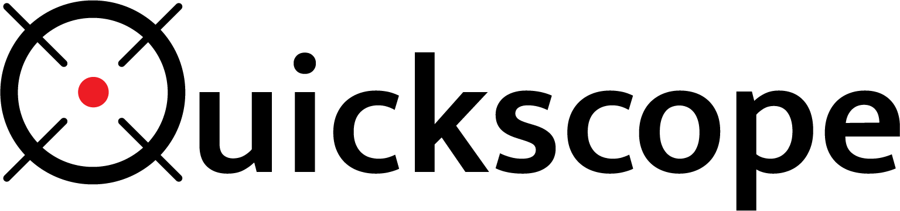
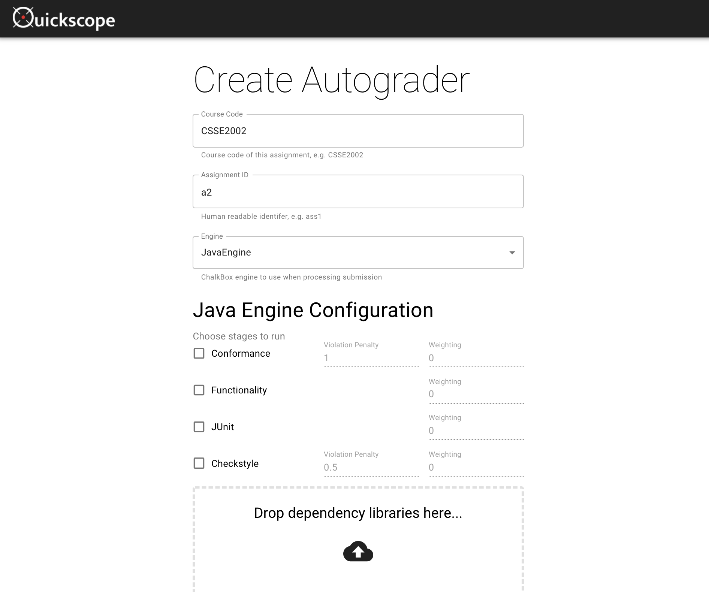

<p align="center"></p>


 


## Overview
Quickscope is used to build [Gradescope](https://www.gradescope.com/) autograders with 
[Chalkbox](https://github.com/uqtools/chalkbox), the University of Queensland ITEE school's
automatic marking system for programming assignments. 

Quickscope is hosted at [quickscope.uqcloud.net](https://quickscope.uqcloud.net) for 
public consumption.

### Key Features
- Support for Python and Java based programming assessment.
- Extensible engine system for introducing new languages and environments.
- Dependency and environment management with [Poetry](https://python-poetry.org/).
- A friendly web interface:


### Build and Run
Quickscope requires the Poetry dependency and environment management system as well as Python 3.8.
If you don't have Poetry installed run:
```
pip install poetry
```
If you don't have Python 3.8 we'd suggest using the [pyenv](https://github.com/pyenv/pyenv) management 
system to install it:
```
pyenv install 3.8.2
```
Once you have those, you can install Quickscope:
```
git clone https://github.com/UQTools/quickscope
cd quickscope
poetry shell
poetry install
poetry run build
```
When the generation of the front end is complete you can run the Quickscope server:
```
poetry run flask run
```
You should now be able to access the service through your browser at `0.0.0.0:5000`.

### Documentation
Documentation for the project is available at [quickscope.readthedocs.org](https://quickscope.readthedocs.org). 
This includes guides on how to use the tool and adapt it to your needs.

### Copyright & License
Quickscope is copyright Nicholas Lambourne, Max Miller & Ella de Lore.

The Quickscope logo is copyright Nicholas Lambourne.

This tool has been licensed for general use under a permissive MIT license 
available [here](./LICENSE).

