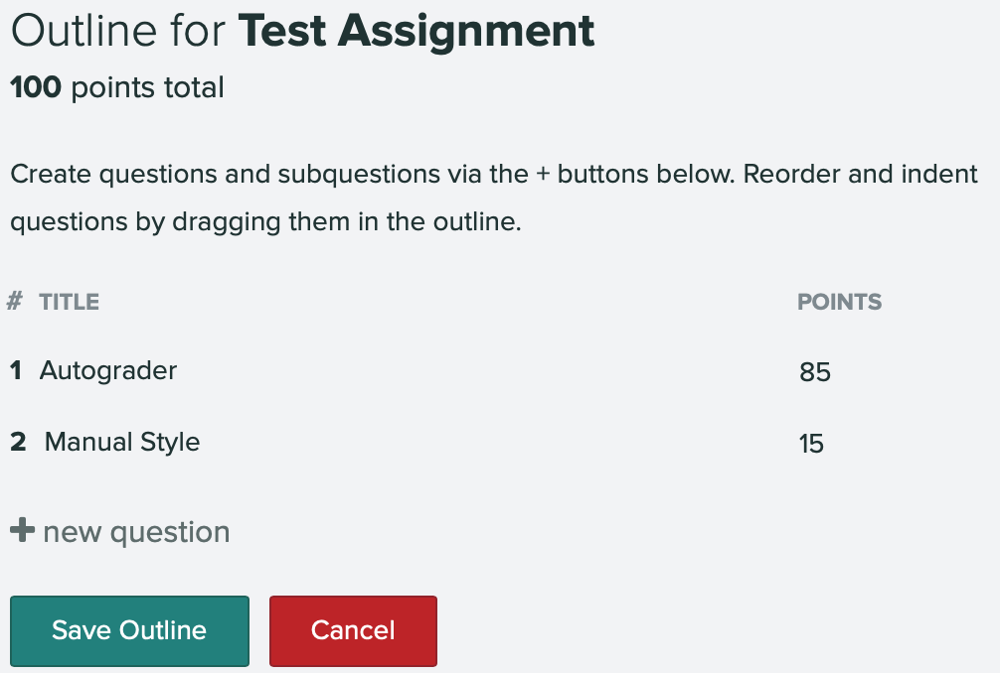
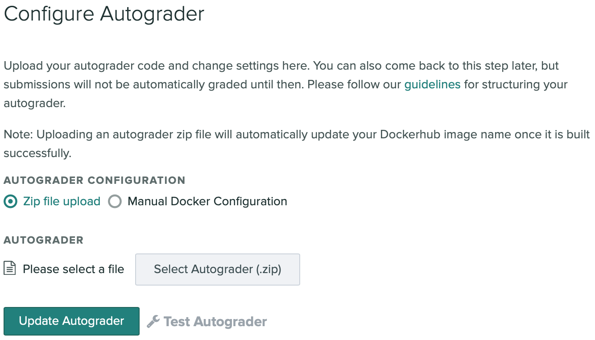
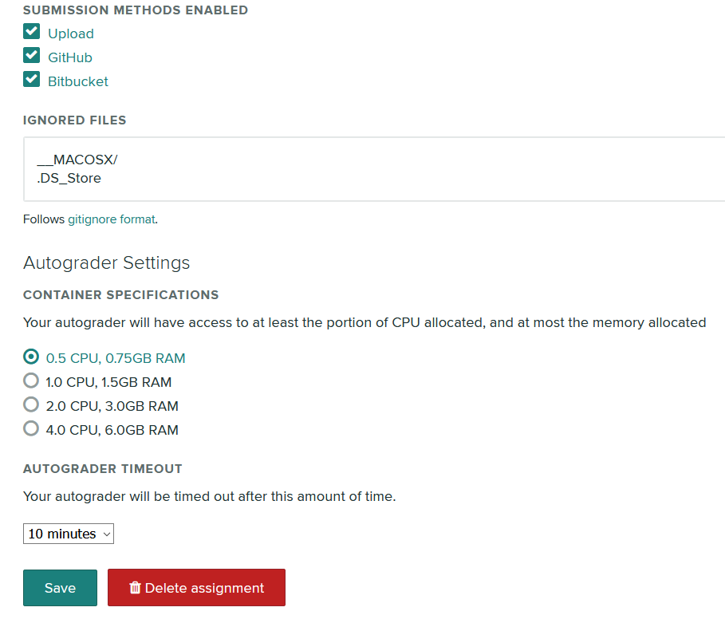

# Setting up an Assignment in Gradescope

This guide explains the process of creating a programming assignment in
Gradescope, using an autograder generated by Quickscope.

## Creating the Assignment

Firstly, follow the steps outlined in Gradescope's demonstration video below
to create a programming assignment using the Gradescope interface.

## Assignment Settings

The following options should be set in the "Assignment Settings" panel when
creating the assignment:

- Autograder points should be set to the total of the weights of all the
automatically marked components of the assignment. This number should be the
maximum possible number of marks achievable in the autograder.
  - For JavaEngine, this will be the sum of all the weights assigned to the
  JavaEngine stages.
  - For PythonEngine, this will be the maximum achievable functionality score,
  excluding the manually marked style component.
- "Enable Manual Grading" should be enabled if there is to be a manually
marked style component
- "Due Date" should be set to the official due date of the assignment.
Submissions made after this date but before the Late Due Date will be marked
as "Late" when marking, along with the number of days it is late.
- "Allow late submissions" should be enabled.
- "Late Due Date" should be set to the last expected submission date of the
longest extension that is allowed for the assignment. Students will not be
allowed to submit after this date. Course staff can still submit
on behalf of students, though students cannot see their autograder results on
submission.

## Outline

In the "Outline" section, an additional question should be created for the
manual style component, including the weighting assigned to manual style.

## Autograder

Finally, the autograder `.zip` generated by Quickscope should be uploaded on
this page by selecting "Zip file upload", "Select Autograder (.zip)" then
"Update Autograder".

After uploading the autograder, you can test that it works correctly by
clicking "Test Autograder" and uploading a student submission, for example, the
correct solution for the assignment written by course staff.

## Other Settings

By clicking the "Settings" link at the bottom of the left sidebar after entering
the assignment page, other various settings can be enabled that are not present
in the "Assignment Settings" panel shown when creating the assignment. Key
changes that can be made here include:
* Specifying which submission methods are allowed. Submission via direct file
  upload, GitHub and Bitbucket can be enabled or disabled.
* Specifying ignored files. Files that match these conditions will be filtered
  out from a student's submission before being processed with ChalkBox. This may
  be useful if ChalkBox is having problems with certain types of files.
* Changing the autograder container's system specifications. More CPU and RAM
  may improve performance.
* Changing the autograder timeout. The default timeout is 10 minutes before
  an autograder instance is killed, however this can be increased up to 40
  minutes.
  
