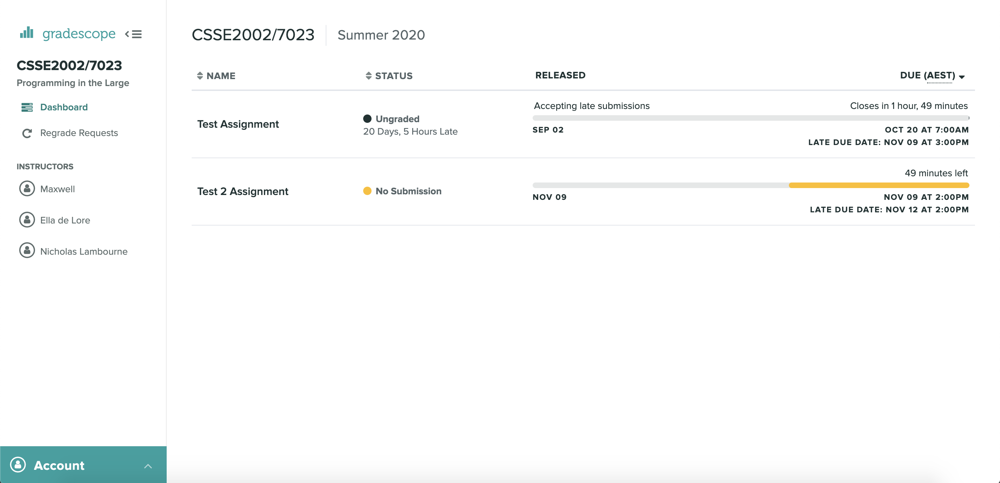
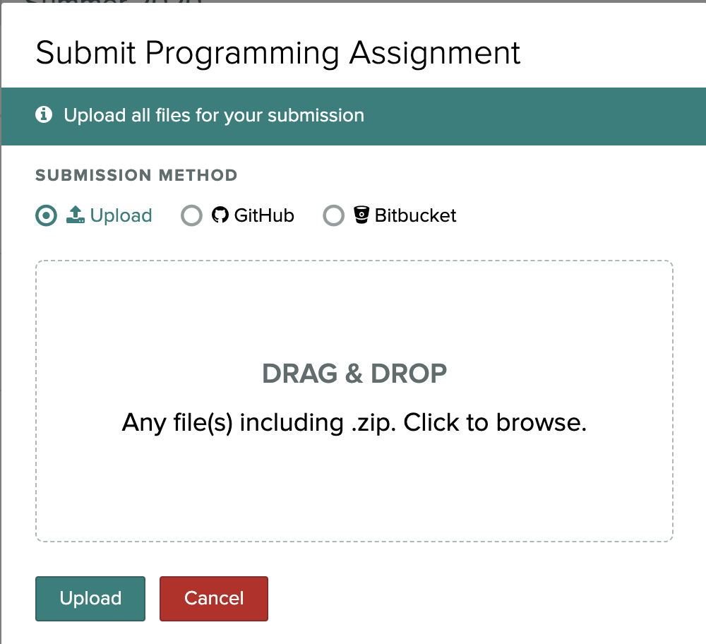
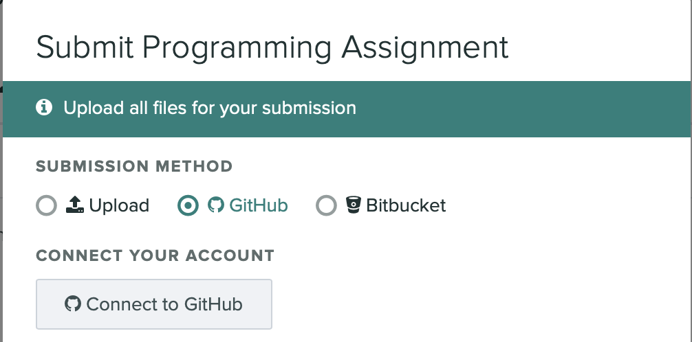
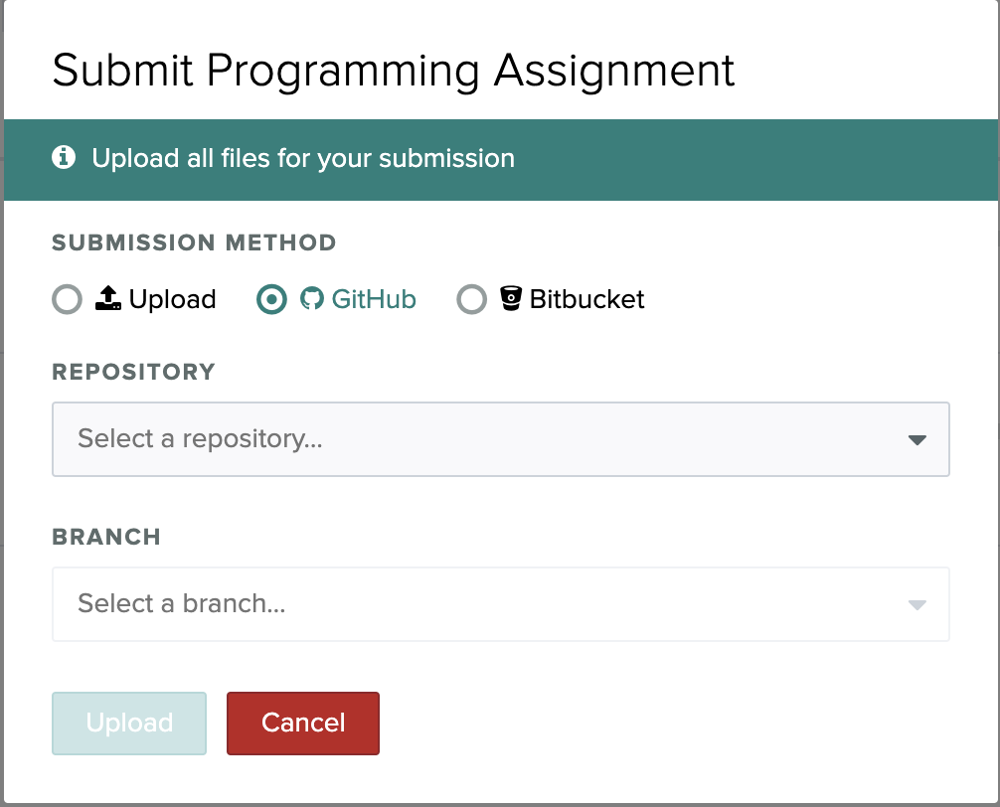

# Submitting to Gradescope

Using Gradescope you are able to submit files either by uploading them or through
a GitHub repository.

To find the submission portal for Gradescope you will need to navigate to the
dashboard for the subject where you will see a list of assignments.



By clicking on the assignment you wish to submit, the submission portal will appear.



## File Upload

If you wish to upload a file, select the upload radio button and either
drag the file from your computer or click on the drag & drop square to open
a file explorer.

### CSSE2002

If you are submitting a file structure with directories you will need to
zip them to preserve the structure.

Specifically for CSSE2002 you will need to zip your top level folders 
(src, test etc) together. In the below example you wouldn't compress `a1`,
you need to select all of the sub folders of a1 (in this case src and test)
and then compress them together.

```
a1
├── src
│   └── tms
│       ├── display
│       │   └── ... files
│       ├── intersection
│       │   └── ... files
│       ├── route
│       │   └── ... files
│       ├── sensors 
│       │   └── ... files
│       └── util
│       │   └── ... files
└── test
    └── tms
        ├── intersection
        │   └── IntersectionTest.java
        └── sensors
            └── DemoPressurePadTest.java
```

## GitHub

If you wish to submit an assignment that is in a GitHub repo you will
need to select the GitHub radio button.



You will then be prompted to connect your GitHub account to Gradescope.



You will then be prompted to select the repository and branch of the
assignment you wish to submit.


## Submission
Once you have selected your options and clicked the `Upload` button,
you will be taken to the results page. The results will not appear instantly as there may be some
processing time. If your course has pre submission feedback you will be able to 
see it there.
