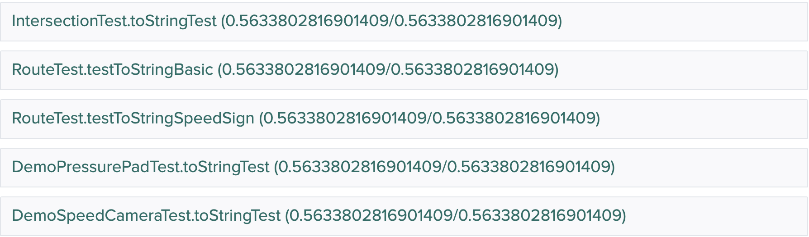

# Understanding Gradescope Feedback CSSE2002

When you have submitted your assignment to gradescope you will receive
feedback on you work. If you submit before the due date you will receive
some prechecks on you assigment. Full feedback will be available at the time of grade release.

## Before Due Date
Before for the due date of the assignment submitting your assignment to gradescope
will allow you to receive some 'prechecks' on your assignment. 

   

These checks are:  
* Compilation - checks if your program compiles, if not, give the conformance error messages.  
      
    
    
* Conformance - checks if your program conforms to the provided specification.  
    

* Functionality - A small number of functionality tests may be provided for you 
to see the functionality of your program.  
    

* JUnit Test Compilation - checks if your provided tests compile with our solution.
If your tests do not compile with our solution then you will receive 0 marks for 
the JUnit section of the assignment  
    

* Style - checks your program for style violations. These violations will be 
deductions from your style marks.
    

## Assignment Feedback
When the assignment grades are published you will be able to view you final grades and feedback.
The screen will be similar to the before feedback information except there will be three main difference.

* Full Functionality - You will be able to see the results from all the functionality tests for the assignment
and if you passed or failed each test.

* Junit Results - You will be able to see the results from your tests. Your tests are run against the solution to
the assignment and a number of faulty solutions. Your mark is based off the number of faulty solutions 
that pass **less** of your tests than the actual solution. The initial in the name
of the test tell you which of your test classes that faulty solution was accessing.
     
    
    
* Style Feedback - You will receive your full style feedback by navigate to the code
tab on the results page.  
      
    This will show you your style grade, too see feedback click on the question name in blue
    (in this exam `Manual Style`) which will expand to show the grading rubric and deductions.
    Files with comments will have the speech box and number of comment. To view the
    comments, click on the file name to expand it.
    
    