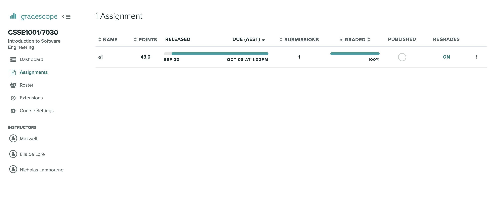
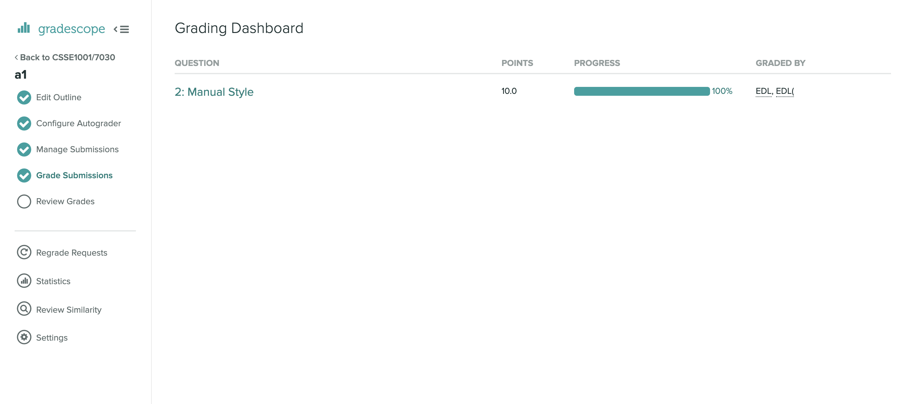
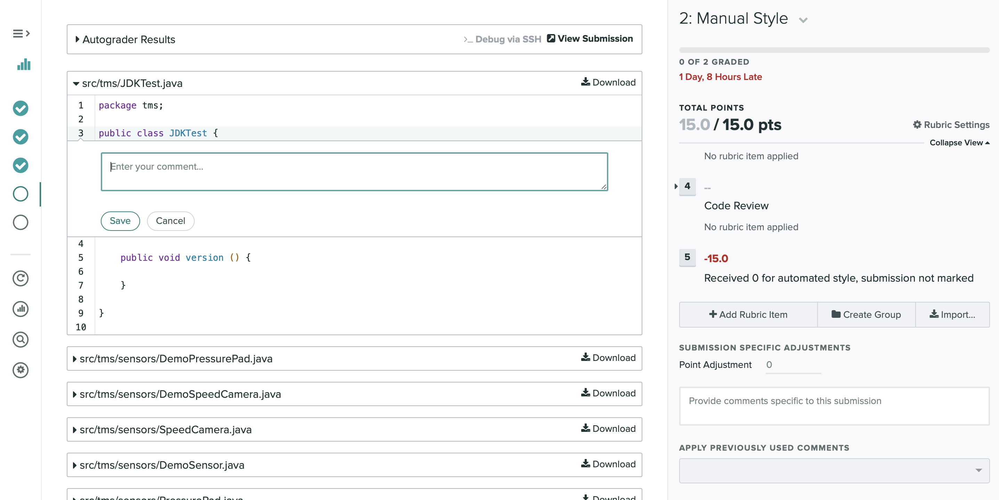

# Style Marking in Gradescope

This guide covers the process of style marking student 
assignments in Gradescope.

##Navigating to Marking Screen

In each course, assignments can be found under the `Assignments` tab.

 

This shows all the current assignments for the course.

To mark a specific assignment, select it from the list.
 
Then select `Grade Submissions` in the right hand menu to navigate to 
the questions in the assignment.

 

For this assignment style marking is graded under one question.

Selecting the question name will take you to a list of the names of students.

##Marking

The Gradescope marking interface uses a number of shortcut to assist with marking.
Please watch the following videos to learn about the interface and these shortcuts.

##Commenting
Comments can be added to student code by clicking on a section of student code. 
A comment box will then appear where you can add your comment and then save.

 
The student will be able to view comments linked to the code that you clicked on.

##Shortcuts

`1 - 9` - Select Rubric Group  
`QWERTY` - Select Rubric Item
  
`Left Arrow` - Previous Student  
`Right Arrow` - Next Student  
`z` - Next Ungraded 
  
`a` - Show all submissions 
  
`.` - Next Question  
`,` - Previous Question

