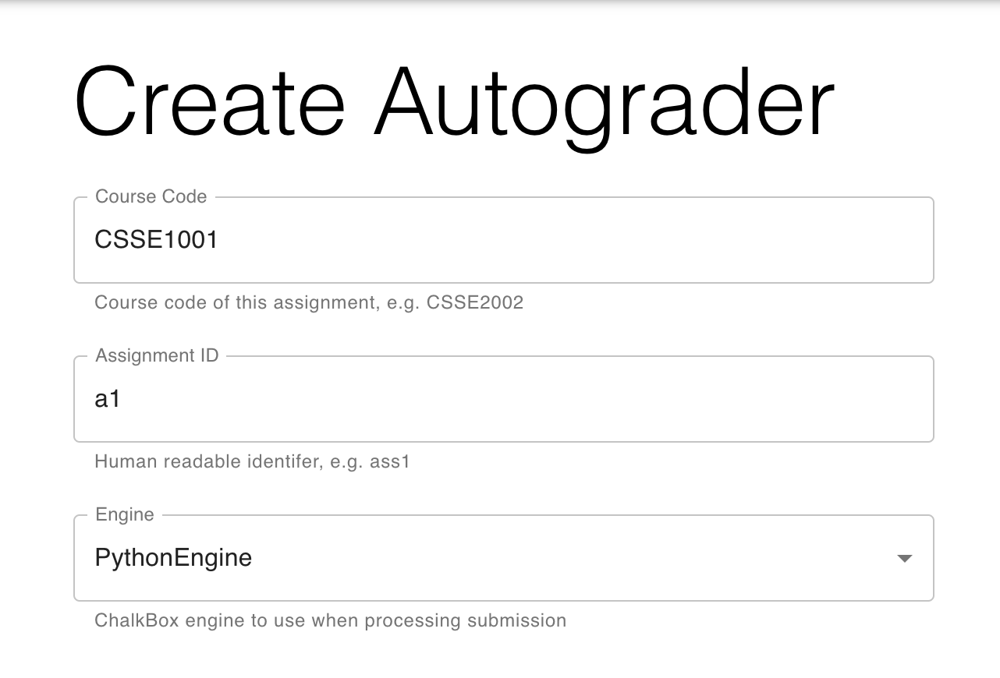
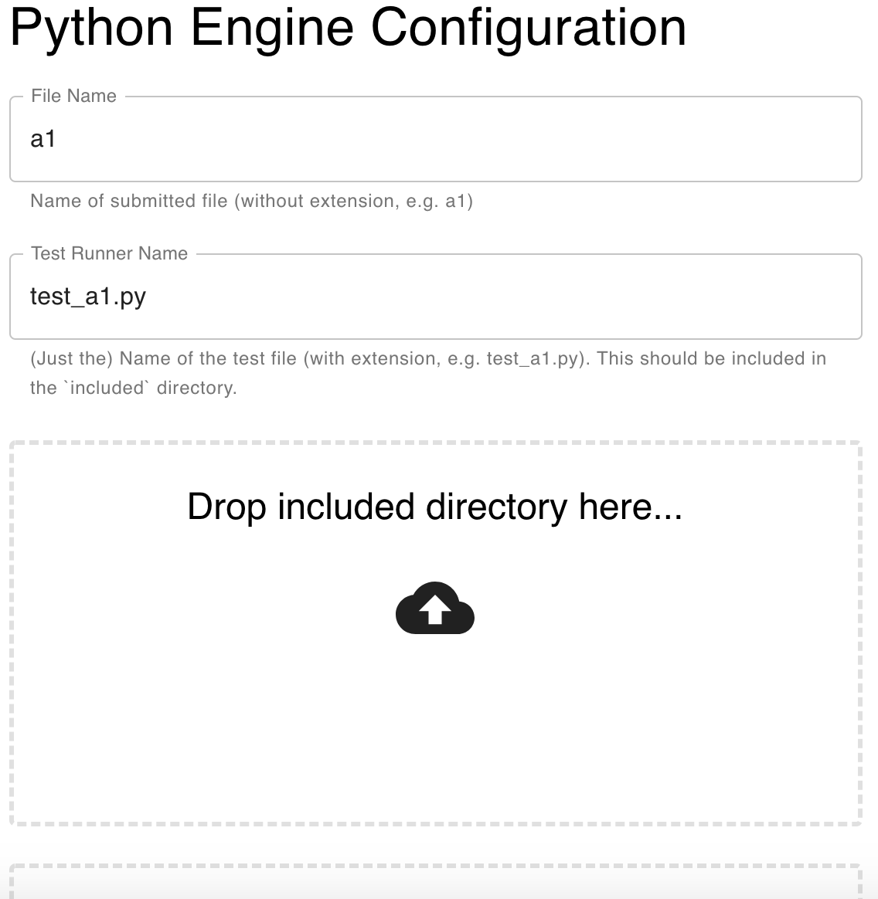

# Creating a PythonEngine Autograder

This guide explains the process of configuring and generating an autograder
bundle in Quickscope, using the Python Engine for ChalkBox.

## Generic Setup

1. Visit [http://quickscope.uqcloud.net](http://quickscope.uqcloud.net) and log in with your UQ credentials.
1. Choose a course code and assignment identifier for the autograder. These
will be displayed in the instructor-facing output for debugging purposes each
time the autograder runs.
1. Choose the PythonEngine under the 'Engine' dropdown box. A set of
engine-specific options will appear below.



## Python Engine Configuration

Here you will be required to provide the needed files for the engine.

You will first have to provide the expected name of the student submitted file (e.g a1)
and the name of test script (e.g test_a1.py).



### Included Folder
You will need to provide a folder of included files to Quickscope containing:
* The test script and dependencies (e.g. for CSSE1001 test_a1.py and testrunner.py)

* Support files for testing (e.g. config files)

* Support files for student code (any file that have been provided to students as support code)


This is an example included folder for CSSE1001 A1 2019:
```
included
│ 
├── test_data
│   │
│   ├── main_fixed_win.in
│   │
│   ├── main_fixed_win.out
│   │
│   ... more files
│
├── a1_test.py
│
├── testrunner.py
│
├── a1_support.py
│
├── WORDS_ARBITRARY.txt
│
└── WORDS_FIXED.txt 
```

### Visible Tests
You will need to provide a text file that contains the names of test classes that
will be available to students before the due date. The results from the tests named
in the file will be visible to students each time they upload a submission to Gradescope.


### JSON Formatter
You will need to provide a python script that reformats the test runner output
to be in a form accepted by Gradescope.

A JSON Formatter for the current CSSE1001 Test Runner can be found at:
[JSON Formatter]([https://github.com/UQTools/chalkbox/blob/master/test/resources/csse1001/included/gradescopeJSONFormatter.py)

## Generating and Uploading Autograder

Finally, once all stages have been configured, the autograder is ready to be
generated.
Simply click the "Generate Autograder Bundle" button at the bottom of the page,
and a `.zip` file containing the entire autograder suite will be downloaded
automatically.
This file can then be uploaded to Gradescope.


