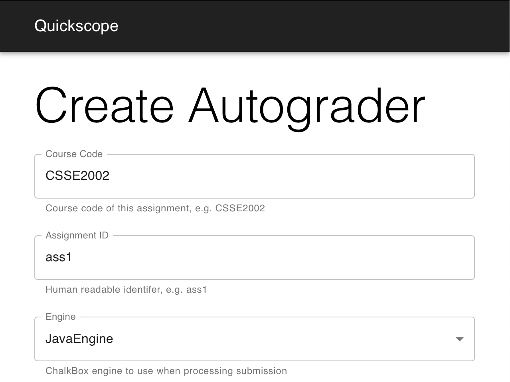
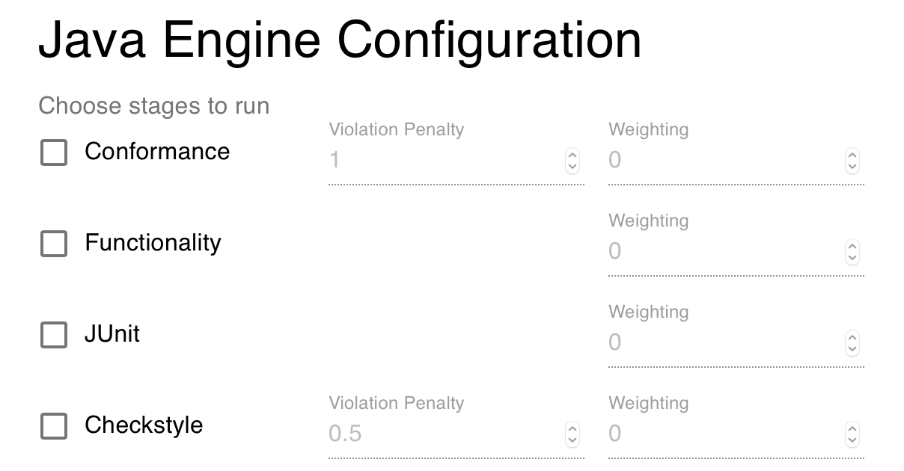
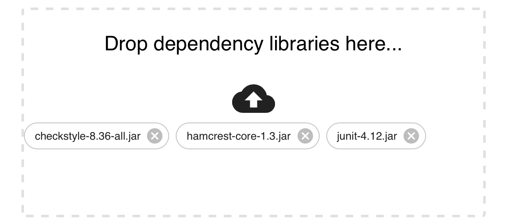
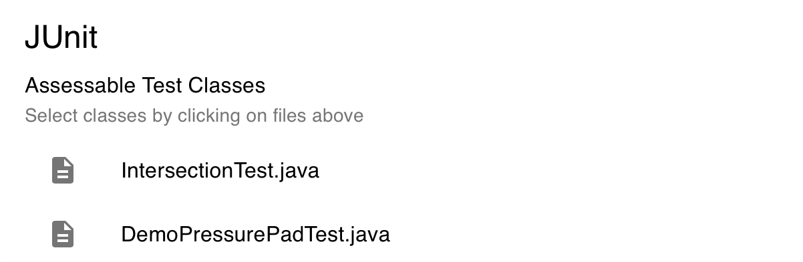

# Creating a JavaEngine Autograder

This guide explains the process of configuring and generating an autograder
bundle in Quickscope, using the Java Engine for ChalkBox.

## Generic Setup

1. Visit http://quickscope.uqcloud.net and log in with your UQ credentials.
1. Choose a course code and assignment identifier for the autograder. These
will be displayed in the instructor-facing output for debugging purposes each
time the autograder runs.
1. Choose the JavaEngine under the 'Engine' dropdown box. A set of
engine-specific options will appear below.



## Java Engine Configuration

Here, you can select the individual stages to be run as part of the autograder.
All stages are optional and can be run separately or together with one or more
other stages. Selecting the checkbox next to the name of a stage will enable
it, and any stage-specific options will appear below.

Each stage has a weighting, which can be changed by entering a number in the
associated text field. This represents the total number of marks, out of 100,
allocated to this stage. A submission that scores perfectly in a given stage
will receive the number of marks entered here. If a weighting is 0, the stage
will still be run, however no marks will be allocated to it.

Immediately below the options for each stage are file drop zones for dependency
libraries and the correct solution directory, explained below.



### Dependencies

Any dependency JARs that are required by the assignment should be added here,
for example, JUnit and Hamcrest. If the Checkstyle stage is enabled, the
Checkstyle JAR should be added here as well.



### Correct Solution

The directory containing the assignment solution should be dragged here. This
directory should contain the two directories `src` and `test`, along with any
extra text files provided by course staff for the purposes of testing
I/O-related classes.
For example, if the directory to be added to Quickscope is called `correct`,
the structure should be:

```
correct
├── saves
│   └── example.txt
├── src
│   └── tms
│       ├── display
│       │   └── SimpleDisplay.java
│       ├── intersection
│       │   └── Intersection.java
│       ├── route
│       │   ├── Route.java
|       ... more files
└── test
    └── tms
        ├── intersection
        │   └── IntersectionTest.java
        ├── route
        │   ├── RouteTest.java
        ... more files
```

The correct solution directory should contain all the solution code for the
assignment inside `src/`, as well as all the tests to be run against the
student submission (if the functionality stage is enabled) in `test/`. 

### Conformance

After enabling the conformance stage by clicking the checkbox under Java Engine
Configuration, the violation penalty can be changed by entering a number in the
input field. This number represents the number of marks deducted for each
instance of non-conformance to the expected public API found in the correct
solution. The total of all deductions is capped at the weighting assigned to
the stage, meaning students cannot receive a negative mark.

A file drop zone is provided for specifying the expected file structure of a
student submission. This should generally be similar to the correct solution
directory, however, only the tests classes that are assessable should be
present. This is to avoid extra test classes being marked as 'missing' in the
conformance check.

For example, if the directory to be added to Quickscope is called
`correct_structure` and the assessable test classes are `IntersectionTest` and
`DemoPressurePadTest`, the structure should be:

```
correct_structure
├── saves
│   └── example.txt
├── src
│   └── tms
│       ├── display
│       │   └── SimpleDisplay.java
│       ├── intersection
│       │   └── Intersection.java
│       ├── route
│       │   ├── Route.java
|       ... more source files
└── test
    └── tms
        ├── intersection
        │   └── IntersectionTest.java
        └── sensors
            └── DemoPressurePadTest.java
```

### JUnit

The JUnit classes that are assessable in the assignment should be selected by
clicking on the rounded boxes representing files under the "Preview:" section
below the correct solution drop zone.

Once a file has been selected, it will appear in the list of Assessable Test
Classes. To remove a file from the list, simply click its rounded box again.



Below the list of assessable test classes, there is a file drop zone for
uploading a directory containing a set of faulty solutions to the assignment,
used when assessing submitted JUnit tests. The correct implementation of the
assignment should also be included in this directory, under `solution/`.

As a suggestion, each subdirectory should be named according to the test class
it is assessing. For example, `pp` for `DemoPressurePadTest`.
These subdirectories should act as the `src/` directory for each solution,
with packages as immediate subdirectories.

For example, if the directory to be added to Quickscope is called
`faulty`, the structure should be:

```
faulty
├── pp_getCongestion_calc
│   ├── README.txt
│   └── tms
│       ├── display
│       │   └── SimpleDisplay.java
│       ├── intersection
│       │   └── Intersection.java
│       ├── route
│       │   ├── Route.java
│       ... more source files
├── ... more faulty solutions
└── solution
     └── tms
         ├── display
         │   └── SimpleDisplay.java
         ├── intersection
         │   └── Intersection.java
         ├── route
         │   ├── Route.java
         ... more source files
```  

### Checkstyle

TODO

## Generating and Uploading Autograder

TODO